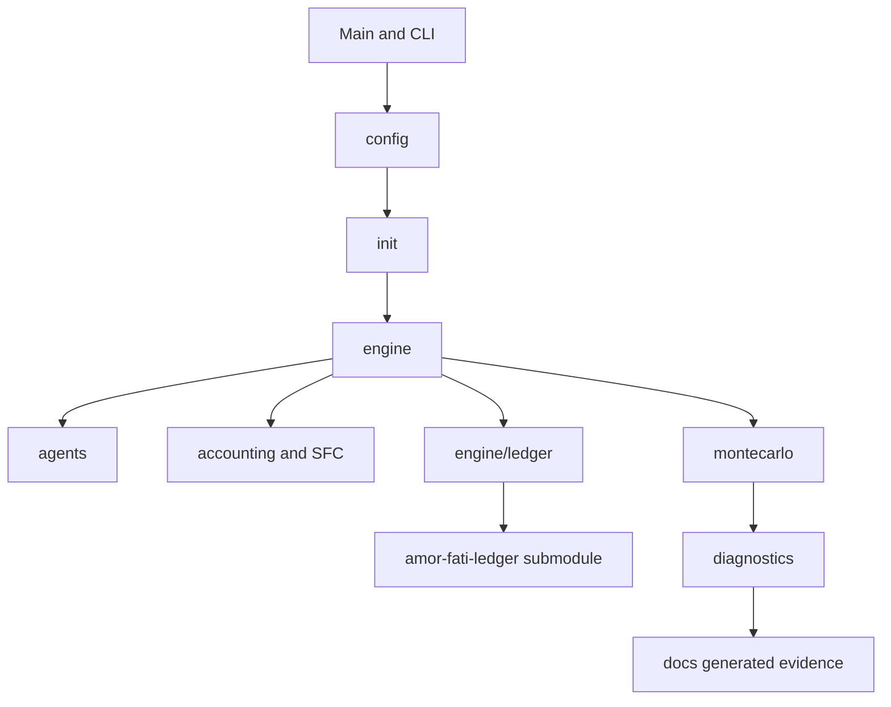

# Architecture Overview

Amor Fati is a ledger-first SFC-ABM implemented as a Scala 3 engine with a
separately verified ledger repository checked out as a Git submodule. The
codebase keeps scientific model contracts in `docs/`, package-local code maps
beside the implementation, and executable invariants in unit, property,
integration, diagnostics, and generated-output checks.

This document is the cross-package map. For package-local file ownership, read
the README next to the relevant code.

## High-Level Shape



The practical dependency rule is:

```text
configuration and initialization build a boundary state
engine executes one month at a time
agents and markets supply behavioral state transitions
flows translate same-month quantities into ledger batches
the verified ledger executes monetary plumbing
SFC and diagnostics validate the resulting evidence
Monte Carlo and diagnostics orchestrate repeated execution
```

## Package Map

| Package or module | Responsibility |
| --- | --- |
| `config/` | `SimParams`, scenario registry, calibration provenance, production-sector crosswalks, and configuration-facing tests. |
| `init/` | Stateless factories for the initial `World`, agent populations, aggregates, and `LedgerFinancialState`. Initialization randomness is explicit through `InitRandomness.Contract`. |
| `agents/` | Autonomous agent facades and agent-local modules. Agent state carries behavior, operational diagnostics, and legacy unsupported metrics; ledger-contracted financial stocks belong in `LedgerFinancialState`. |
| `engine/` | Month-boundary runtime state, same-month economics orchestration, closed-month projection, markets, mechanisms, flow emission, ledger projection, traces, and failure semantics. |
| `engine/economics/` | Ordered same-month calculus stages. These modules decide quantities, prices, rates, and state transitions. They do not emit runtime ledger batches. |
| `engine/flows/` | Translation from same-month quantities into named `FlowMechanism` batches, runtime execution through the ledger interpreter, SFC semantic projection, traces, and next-state advancement. |
| `engine/ledger/` | Engine-side ownership contract for ledger-backed financial stocks, supported owner/asset pairs, runtime survivability classifications, and materialization of supported runtime deltas. |
| `accounting/` | SFC identities, initialization checks, balance-sheet checks, and symbolic matrix registry/rendering support. |
| `montecarlo/` | Production seed/month runner, output schemas, TSV I/O, console progress, and typed run errors. It depends on the engine; the engine does not depend on Monte Carlo. |
| `diagnostics/` | Exporters and reports for generated evidence, scenario runs, calibration bridges, nightly diagnostics, and profiling inputs. |
| `networks/`, `math/`, `random/`, `fp/`, `util/` | Supporting libraries for network topology, numeric helpers, deterministic streams, functional helpers, and shared utilities. |
| `modules/ledger/` | Git submodule checkout of the separate `amor-fati-ledger` repository; used by the runtime flow path through the root sbt build. |
| `integration-tests/` | PR-level runtime and output integration gates over the production initialization and month-driver path. |

## Runtime Core

The runtime core is the `FlowSimulation.SimState -> FlowSimulation.StepOutput`
transition. A `SimState` contains the completed month index, `World`, firm,
household, and bank populations, household aggregates, and
`LedgerFinancialState`.

The public one-month transition is
[`FlowSimulation.step`](../../modules/model/src/main/scala/com/boombustgroup/amorfati/engine/flows/FlowSimulation.scala).
Repeated execution should go through
[`MonthDriver`](../../modules/model/src/main/scala/com/boombustgroup/amorfati/engine/MonthDriver.scala),
which owns the unfold over explicit `MonthRandomness.Contract` values supplied
by the caller.

See [runtime-loop.md](runtime-loop.md) for the exact code path.

## Layering Rules

The architecture relies on a few rules that are stronger than naming
conventions:

| Rule | Meaning |
| --- | --- |
| Economics before flows | Same-month economics computes quantities and decisions before flow emission. `engine/economics` should not construct runtime ledger batches. |
| Translation before execution | `MonthFlowEmitter` maps `MonthlyCalculus` into named batches. It should not redo economics or decide new behavior. |
| Execution before supported materialization | The verified ledger interpreter executes batches and returns deltas. `RuntimeFlowProjection` materializes only the supported persisted stock slice. |
| Ledger-owned stocks outside `World` | Financial stocks with an engine ledger contract live in `LedgerFinancialState`, not as ad hoc mutable balances on `World`. |
| Domain numerics are typed fixed point | Core economics, runtime, ledger-boundary, and SFC code use semantic Long-backed fixed-point types from [`types.scala`](../../modules/model/src/main/scala/com/boombustgroup/amorfati/types.scala) rather than raw `Double` values. |
| Package README is local | Package README files explain nearby files. Cross-package architectural contracts live under `docs/architecture`. |

## Numeric Layer

Domain quantities are not represented as interchangeable floating-point values.
The public type surface in
[`types.scala`](../../modules/model/src/main/scala/com/boombustgroup/amorfati/types.scala)
re-exports opaque fixed-point types such as `PLN`, `Rate`, `Share`, `Scalar`,
`Multiplier`, `Coefficient`, `PriceIndex`, `Sigma`, `ExchangeRate`, and
`ExchangeRateShock`.

The shared fixed-point implementation lives in
[`fp/FixedPointBase.scala`](../../modules/model/src/main/scala/com/boombustgroup/amorfati/fp/FixedPointBase.scala):

```text
raw representation: Long
scale: 10^4
rounding: shared fixed-point helpers, including banker's rounding
semantic safety: cross-type operations are explicit
```

This is an architectural contract, not a style preference. Monetary flows and
SFC identities need exact raw-value behavior; rates, shares, and multipliers
need type-visible semantics. External parsing, tests, and diagnostics may use
`BigDecimal` at boundaries, but core model execution should enter through the
typed fixed-point layer. See
[ADR-0005](../adr/0005-fixed-point-domain-numerics.md).

## Evidence Layers

Architecture is enforced by several layers rather than one large test suite:

| Layer | Examples |
| --- | --- |
| Unit and property tests | Agent rules, market mechanics, flow emitters, SFC identities, ownership contracts, schema renderers. |
| Engine step tests | `FlowSimulationSpec`, `FlowSimulationStepSpec`, `NextStateAdvancerSpec`, `RuntimeFlowExecutorSpec`, and related flow tests. |
| Integration tests | `BaselineInvariantIntegrationSpec` and `McRunnerTsvIntegrationSpec` under `integration-tests/`. |
| Generated-output guard | `scripts/check-generated-outputs.sh` verifies committed generated evidence. |
| Documentation hygiene | `scripts/check-docs.py` validates local Markdown links, anchors, and inventory coverage. |
| Nightly and stress diagnostics | Scheduled workflows route model-health, scenario, robustness, and profiling evidence. |

For invariant ownership and failure severity, use
[engine-invariants-and-semantics.md](../engine-invariants-and-semantics.md).
